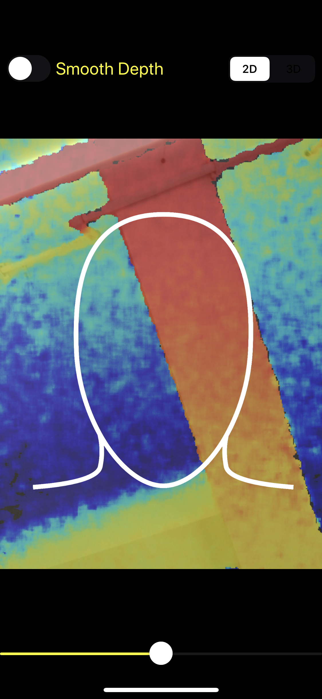
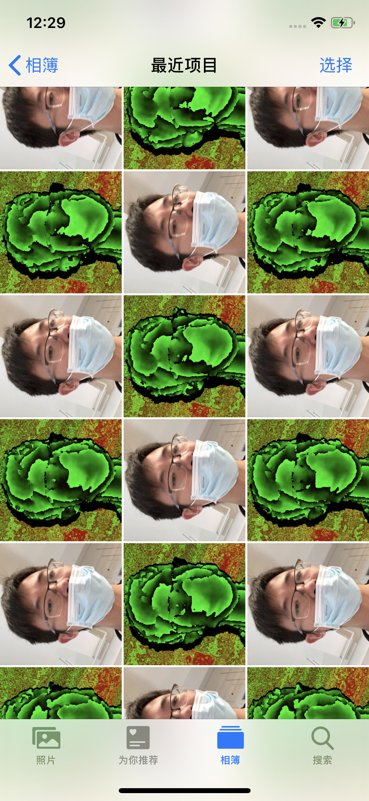
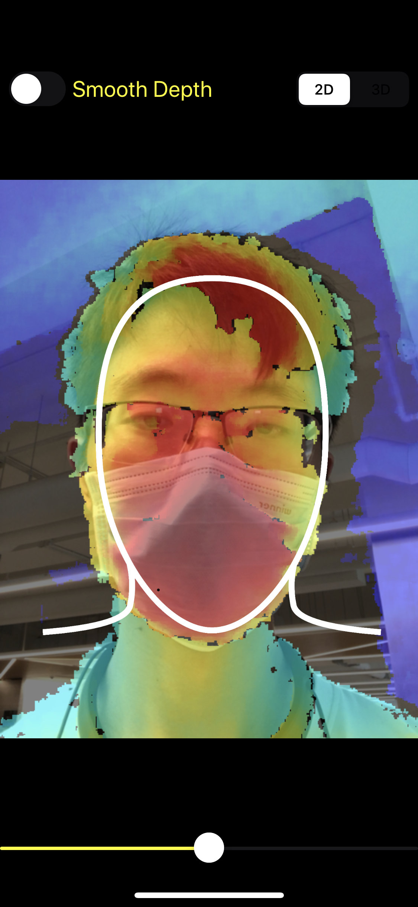

## This IOS code is used to dump RGB-D  images.
This code is modified from Apple Sample Code:   https://developer.apple.com/documentation/avfoundation/cameras_and_media_capture/streaming_depth_data_from_the_truedepth_camera

## Build and Run in iphone
Your need an iphone with depth sensor. 

Open with xcode, compile, Connect your iphone, install and run. 

You will see something like below on your iphone.

**Note**: the moment the APP is opened, it starts to dumping RGB-D  images to the album. And it won’t stop until you close the APP.

The collected RGB-D images will be saved in the album. like this：

Then you can freely export them from the album.

## For Human Face
We added a guide circle. In order to collect the depth of the face better, we recommend that the face of the collector be closer to the screen until the face is about the same size as the guide circle.

 

